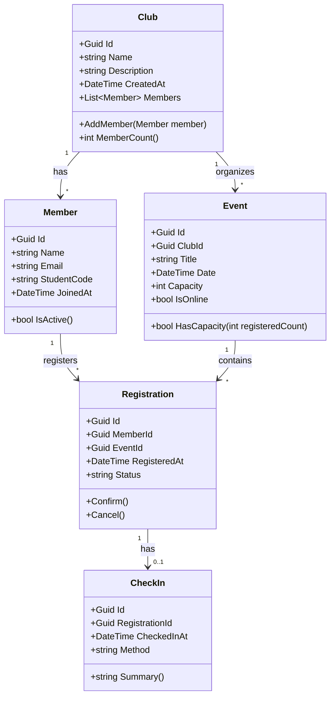

# EduHub so do lop
/// Ctrl+Shift+V để xem

```mermaid
classDiagram
    class Member {
        +Guid Id
        +string Name
        +string Email
        +string StudentCode
        +DateTime JoinedAt
        +bool IsActive()
    }

    class Club {
        +Guid Id
        +string Name
        +string Description
        +DateTime CreatedAt
        +List~Member~ Members
        +AddMember(Member member)
        +int MemberCount()
    }

    class Event {
        +Guid Id
        +Guid ClubId
        +string Title
        +DateTime Date
        +int Capacity
        +bool IsOnline
        +bool HasCapacity(int registeredCount)
    }

    class Registration {
        +Guid Id
        +Guid MemberId
        +Guid EventId
        +DateTime RegisteredAt
        +string Status
        +Confirm()
        +Cancel()
    }

    class CheckIn {
        +Guid Id
        +Guid RegistrationId
        +DateTime CheckedInAt
        +string Method
        +string Summary()
    }

    Member "1" --> "*" Registration : registers
    Club "1" --> "*" Member : has
    Club "1" --> "*" Event : organizes
    Event "1" --> "*" Registration : contains
    Registration "1" --> "0..1" CheckIn : has
```
